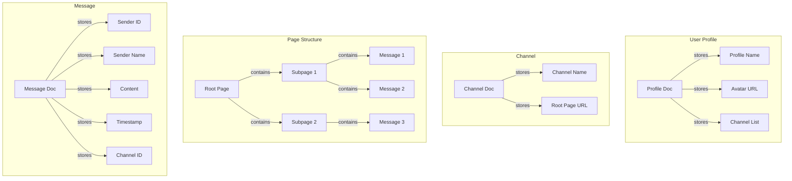

# MSSGER - Decentralized Messenger

A decentralized messenger application built with TypeScript, React, and Automerge for peer-to-peer synchronization.

## Tech Stack

- **Frontend**: React + TypeScript
- **State Management**: Automerge
- **Package Manager**: pnpm
- **Build Tool**: Vite
- **Styling**: TailwindCSS
- **Testing**: Vitest + React Testing Library

## Data Structure

The application uses Automerge documents (AM docs) to manage different aspects of the data:



## Project Architecture

### Core Components

1. **Data Layer**

   - Automerge document management
   - CRDT synchronization
   - Local storage integration
   - Peer-to-peer networking

2. **Domain Layer**

   - Data models and types
   - Business logic
   - State management
   - Event handling

3. **UI Layer**
   - React components
   - User interactions
   - Routing
   - Styling

## File Structure

```
src/
├── data/                 # Data layer
│   ├── automerge/       # Automerge document management
│   ├── storage/         # Local storage handling
│   └── sync/           # Synchronization logic
│
├── domain/              # Domain layer
│   ├── models/         # Data models and types
│   ├── services/       # Business logic
│   └── events/         # Event handling
│
├── ui/                  # UI layer
│   ├── components/     # React components
│   ├── pages/         # Page components
│   ├── hooks/         # Custom React hooks
│   └── styles/        # Styling
│
├── utils/              # Utility functions
├── config/             # Configuration files
└── types/              # TypeScript type definitions
```

## Getting Started

1. Install dependencies:

   ```bash
   pnpm install
   ```

2. Start development server:

   ```bash
   pnpm dev
   ```

3. Build for production:
   ```bash
   pnpm build
   ```

## Development

- `pnpm dev` - Start development server
- `pnpm build` - Build for production
- `pnpm test` - Run tests
- `pnpm lint` - Run linter
- `pnpm type-check` - Run type checking

## License

MIT
